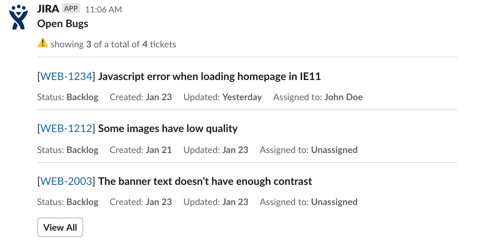

## slack-jira-query

Run a JIRA query and send the results to a Slack channel.

This tool was created with the intension of running it every morning and send a report of outstanding bugs to a Slack channel to add visibility.

### Setup

The package should be installed globally with `npm install -g slack-jira-query` and the following environment variables must be set when running the application:

-   `SLACK_WEBHOOK`: url of the Slack webhook used for sending the message
-   `SLACK_CHANNEL`: the channel where the reports are going to be sent to
-   `SLACK_EMOJI` (optional): define the emoji used by the application when sending the reports. Defaults to `:robot_face:`.
-   `JIRA_HOST`: the Atlassian url (for example `https://your_company_name.atlassian.net`)
-   `JIRA_USERNAME`: Atlassian username that will be used to run the query
-   `JIRA_API_KEY`: API key created by `JIRA_USERNAME`. You can create one in https://id.atlassian.com/manage/api-tokens
-   `JIRA_QUERY`: the query in JQL to be executed (for example `issuetype=Bug AND resolution=Unresolved`)
-   `JIRA_QUERY_NAME`: this name will be included in the report's header
-   `MAX_ISSUES` (optional): the maximum number of issues to be included in the report. Cannot be greater than `20`, and defaults to `5`.
